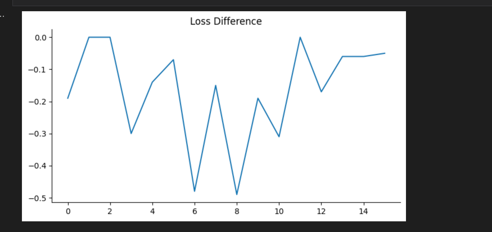

# Transformer-Interpretability

Transformer Interpretability using transformerlens. Plotting all the heads of a single layer to see different attentions and ablating different heads to see how much they affect output.

## Packages used 
Pytorch

transformer_lens

circuitsvis


## Model 

TinyStories-1Layer-21M : Model trained on the TinyStories Dataset


### Transformer Lens - Interpretation
- Formerly known as **EasyTransformer**
- Library for doing **Mechanistic interpretability** ->  The goal of mechanistic interpretability is to take a trained model and reverse engineer the algorithms the model learned during training from its weights.
- Which is important for **transparency, debugging, compliance, and ethical considerations in AI**.
- TransformerLens lets you load in an open source language model, like GPT-2, and exposes the internal activations of the model to you.
- You can cache any internal activation in the model, and add in functions to edit, remove or replace these activations as the model runs.
- TransformerLens comes loaded with >40 open source GPT-style models. You can load any of them in with ```HookedTransformer.from_pretrained(MODEL_NAME)```.

## Caching all Activations

The first basic operation when doing mechanistic interpretability is to break open the black box of the model and look at all of the internal activations of a model. This can be done with `logits, cache = model.run_with_cache(tokens)`..

Every activation inside the model begins with a batch dimension. Here, because we only entered a single batch dimension, that dimension is always length 1 and kinda annoying, so passing in the `remove_batch_dim=True` keyword removes it.

Attention pattern of all the heads in layer 0 are visulaized using [Alan Cooney's CircuitsVis library](https://github.com/alan-cooney/CircuitsVis) (based on [Anthropic's PySvelte library](https://github.com/anthropics/PySvelte)).

We look this the attention pattern in `cache`, an `ActivationCache` object, by entering in the name of the activation, followed by the layer index (here, the activation is called "attn" and the layer index is 0). This has shape [head_index, destination_position, source_position], and we use the `model.to_str_tokens` method to convert the text to a list of tokens as strings, since there is an attention weight between each pair of tokens.

This visualization is interactive! Try hovering over a token or head.


### Observations and Key points

- There are 16 Attention heads in this model:
  <br>
  Self Attention: Head-8 is the prominant example of such an attention
  <br>
  Distance Based Attention: Head-5 is the prominant exampe of distance based attention
  <br>
  Semantic Based Attention: Head-11 & Head-12 is one of the prominant example of semantic based attention
  <br>
  Other type of contextual relationships: Head-9, Head-12 and Head-13 plays differnt understanding of context (which is awesome)

## Hooks - Intervening on Activations

One of the great things about interpreting neural networks is that we have *full control* over our system. From a computational perspective, we know exactly what operations are going on inside (even if we don't know what they mean!). And we can make precise, surgical edits and see how the model's behaviour and other internals change.


The key feature here is hook points. Every activation inside the transformer is surrounded by a hook point, which allows us to edit or intervene on it.

We do this by adding a hook function to that activation. The hook function maps current_activation_value, hook_point to new_activation_value. As the model is run, it computes that activation as normal, and then the hook function is applied to compute a replacement, and that is substituted in for the activation. The hook function can be an arbitrary Python function, so long as it returns a tensor of the correct shape.



### Observations and Key points

From this we can clearly see that
- Head 1 and 2 makes no difference to the output as when we removed these layers one by one it doesnt make any difference in the average loss. 
- Head 6 and 8 when abalated increased the loss.